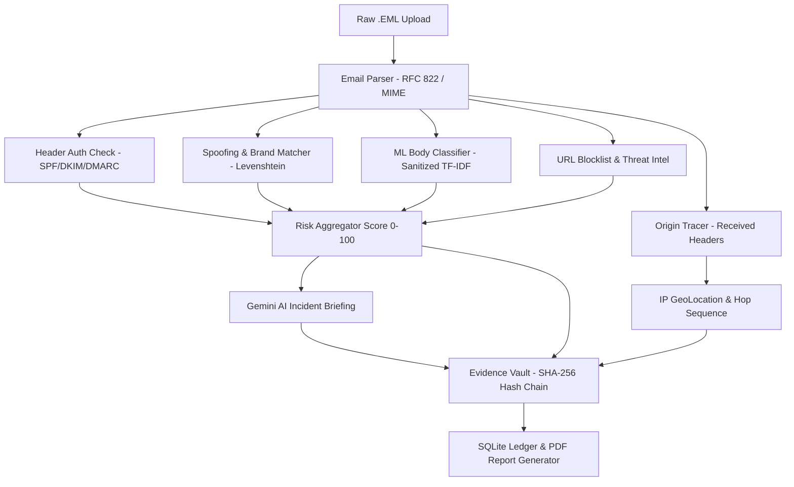

<div align="center">

# Smart India Hackathon 2026 — Team CodeYappers

# ThreatLens

### AI-Powered Email Threat Detection, GeoLocation & Forensic Intelligence Platform

**Detect the Threat. Trace the Source. Prove the Fraud.**

*Smart India Hackathon 2026 — Problem Statement ID: SIH26106*
*Theme: Blockchain & Cybersecurity | Category: Software*
*Organization: All India Council for Technical Education (AICTE) — Cyber Security Cell*

**Team CodeYappers**

[](https://www.python.org/)
[](https://fastapi.tiangolo.com/)
[](https://react.dev/)
[](#license)

[Report Bug](#) · [Request Feature](#)

</div>

---

## Table of Contents

- [About The Project](#about-the-project)
- [The Problem](#the-problem)
- [Our Solution](#our-solution)
- [How It Works](#how-it-works)
- [Tech Stack](#tech-stack)
- [System Architecture](#system-architecture)
- [Getting Started](#getting-started)
- [Usage](#usage)
- [Testing & Auditing](#testing--auditing)
- [Project Structure](#project-structure)
- [Impact & Benefits](#impact--benefits)
- [Future Scope](#future-scope)
- [Research & References](#research--references)
- [Team](#team)
- [License](#license)

---

## About The Project

**ThreatLens** is an end-to-end cyber-forensic platform built to address one of the most under-addressed problems in digital security today: Business Email Compromise (BEC), spear-phishing, brand impersonation, and wire fraud carried out through email.

Most existing tools stop at flagging a message as spam. ThreatLens goes three steps further — it explains why an email is fraudulent, traces where it actually came from, and produces tamper-proof, investigation-ready evidence, all from a single platform instead of three disconnected tools.

Inspired by real-world incidents such as the November 2025 email spoofing fraud involving Dr. Reddy's Laboratories and Group Pharmaceuticals — where diverted funds were recovered only because police intervened within a narrow window of time — ThreatLens is built to catch such fraud before it happens, or trace it instantly if it doesn't.

---

## The Problem

Email fraud is easy to execute and difficult to trace once it succeeds. Spam filters catch obvious junk mail, but not targeted spoofing or Business Email Compromise, leaving businesses, banks, and government bodies exposed.

| Statistic | Source |
|---|---|
| 22% of India's 29.44 lakh cyber incidents (2025) are phishing-driven | CERT-In / SARO Threat Landscape Report |
| Only 1–3% of cybercrime complaints ever convert into an FIR | Vaarta Cybercrime Statistics Report |
| 24% spike in cybercrime cases, ₹22,495 crore lost nationally (2025) | InsightsIAS |
| ₹2.16 crore diverted via email spoofing — Dr. Reddy's Laboratories, Nov 2025 | The Tribune |

Investigators are left without adequate tools to trace an email's true origin or preserve evidence that holds up in an investigation. ThreatLens is built to close that gap.

---

## Our Solution

ThreatLens runs every suspicious email through a single pipeline that performs five functions:

- **Detect** — Flags fraud with a clear, explainable risk score (0–100) and specific reasons
- **Trace** — Maps the email's real origin using its own header trail, not just its claimed sender
- **Correlate** — Automatically links related fraud attempts sharing the same sender domain or IP
- **Preserve** — Locks every finding into a tamper-proof, hash-chained forensic record
- **Result** — Hours of manual header and IP investigation reduced to seconds, with a report an investigator can act on immediately

---

## How It Works

ThreatLens runs as a continuous six-step cycle for every email:

```
1. Email Ingested        - Raw .EML upload, parsed via RFC 822/MIME
2. Header & Content Scan - SPF/DKIM/DMARC check, brand/spoofing matcher,
                            sanitized ML classifier, URL threat intel
3. Risk Scoring          - Risk Aggregator combines all signals into a 0-100 score
4. Origin Tracing        - Parses Received headers, geolocates IP hop sequence
5. Forensic Logging      - SHA-256 hash-chain Evidence Vault, sealed into SQLite ledger
6. Report & Dashboard    - Gemini AI incident briefing plus exportable PDF report
```

### Pipeline A — Detection

```
Email Upload -> Parser (RFC 822/MIME)
   -> SPF/DKIM/DMARC Check
   -> Spoofing & Brand Matcher (Levenshtein distance)
   -> Sanitized ML Classifier (TF-IDF + Logistic Regression)
   -> URL Blocklist & Threat Intel
   -> Risk Aggregator (0-100)
   -> Gemini AI Incident Briefing
```

### Pipeline B — Trace & Evidence

```
Received Header Chain -> IP Extraction (filters private IPs)
   -> GeoLocation Lookup (ip-api.com)
   -> Hop Sequence Map with Origin Highlighted
   -> SHA-256 Hash
   -> Evidence Vault (Hash Chain)
   -> SQLite Ledger & PDF Report Generator
```

### Key Technical Highlights

- **Brand Impersonation Detection** — Compares sender domains against protected brand lists using Levenshtein edit distance, and detects local-part impersonation (subtly altered lookalike addresses) and display-name mismatches.
- **Leak-Free ML Training** — The classifier vectorizes only the email body, stripping routing headers to prevent data leakage from local server names such as `postfix` or `localhost`.
- **Multilingual Urgency Detection** — Flags coercive urgency keywords across languages (for example, "expirando hoje," "immediate action," "unauthorized transfer").
- **Cryptographic Chain of Custody** — Every logged action is hashed as:

  ```
  entry_hash = SHA256(id || email_id || action || actor || timestamp || data_hash || prev_hash)
  ```

  If any historical entry is altered, the chain breaks and the tampering is detectable via the `/api/emails/{id}/verify-chain` endpoint or the `inspect_vault.py` CLI tool.

---

## Tech Stack

| Layer | Technology | Purpose |
|---|---|---|
| Frontend | React 19 + Vite 8 | Dynamic single-page security dashboard |
| Styling | TailwindCSS v4 + Lucide React | Dark theme UI, responsive layout |
| Backend | FastAPI (Python 3.11) | High-performance async REST API with OpenAPI docs |
| Database & ORM | SQLite + SQLAlchemy 2.0 | Structured case storage, email metadata, forensic ledger |
| AI / ML | scikit-learn (TF-IDF + Logistic Regression) | Header-sanitized phishing body classification |
| LLM Integration | Google Gemini API (via httpx) | Executive incident briefings for analysts |
| Geospatial Mapping | Leaflet + React-Leaflet | Visualizing network hop trails and threat origin |
| PDF Reporting | ReportLab | Tamper-evident forensic evidence report generation |
| Threat Intel APIs | ip-api.com, PhishTank, WHOIS | Geolocation, malicious URL checks, origin attribution |
| Security | SHA-256 (hashlib) | Tamper-evident hash-chain logging |

---

## System Architecture



---

## Getting Started

### Prerequisites

- Python 3.11 or later
- Node.js 18+ and npm
- A Google Gemini API key (for incident briefings)

### Installation

1. Clone the repository

   ```bash
   git clone https://github.com/<your-org>/threatlens.git
   cd threatlens
   ```

2. Set up the backend

   ```bash
   python -m venv .venv
   .venv\Scripts\activate        # Windows
   source .venv/bin/activate     # macOS/Linux

   pip install -r backend/requirements.txt
   ```

3. Configure environment variables

   Create a `.env` file in the project root:

   ```env
   GEMINI_API_KEY=your_gemini_api_key_here
   DATABASE_URL=sqlite:///./threatlens.db
   ```

4. Set up the frontend

   ```bash
   cd frontend
   npm install
   ```

5. Run the backend server

   ```bash
   $env:PYTHONPATH="."                       # Windows PowerShell
   uvicorn backend.app.main:app --reload
   ```

   Backend runs at `http://127.0.0.1:8000`. Swagger docs at `http://127.0.0.1:8000/docs`.

6. Run the frontend dashboard

   ```bash
   cd frontend
   npm run dev
   ```

   Dashboard runs at `http://localhost:5173`.

### Default Accounts

| Role | Email | Password |
|---|---|---|
| Analyst | analyst@threatlens.io | threatlens2026 |
| Admin | admin@threatlens.io | admin2026 |

---

## Usage

1. Log in to the dashboard as an Analyst or Admin.
2. Upload a `.eml` file, or paste raw email headers, via the Scan Email screen.
3. Review the generated risk score, flagged reasons, and Gemini-powered incident summary.
4. Explore the geolocation map showing the email's real hop-by-hop journey.
5. Check the Evidence Vault to verify the tamper-proof hash-chain.
6. Export a full forensic PDF report suitable for investigation or FIR filing.
7. View linked cases where multiple emails share the same fraudulent sender or IP.

---

## Testing & Auditing

```bash
# Run backend unit tests
$env:PYTHONPATH="."
.venv\Scripts\pytest.exe backend/tests

# Audit the Evidence Vault's cryptographic hash-chain
.venv\Scripts\python.exe inspect_vault.py

# Retrain the phishing ML pipeline (header-sanitized)
.venv\Scripts\python.exe retrain_pipeline.py
```

---

## Project Structure

```
threatlens/
├── backend/
│   ├── app/
│   │   ├── services/
│   │   │   ├── threat_scanner.py      # Detection engine (rules + ML)
│   │   │   ├── origin_tracer.py       # Header parsing and geolocation
│   │   │   ├── evidence_vault.py      # SHA-256 hash-chain logging
│   │   │   └── case_linker.py         # Case correlation engine
│   │   └── main.py
│   └── tests/
├── frontend/
│   ├── src/
│   └── package.json
├── inspect_vault.py                    # CLI tool to audit the hash-chain
├── retrain_pipeline.py                 # ML retraining script
└── README.md
```

---

## Impact & Benefits

| Beneficiary | Impact |
|---|---|
| Businesses / Enterprises | Prevent costly BEC fraud before payments are made |
| Cyber Cells / Investigators | Ready-made evidence and origin-tracing in seconds, not hours |
| Banks & Financial Institutions | Real-time screening of suspicious payment-related emails |
| Government Bodies | A standardized, scalable tool to raise cybercrime-to-FIR conversion rates |
| Nation / Society | Fewer successful scams, stronger alignment with Digital India's cybersecurity goals |

**Business Potential:** ThreatLens can be positioned as a subscription-based B2B SaaS for banks, enterprises, and cyber cells, priced per seat or email volume, with room to expand into MSMEs and legal or forensic service providers.

---

## Future Scope

- Live Gmail/Outlook inbox integration via OAuth
- Extend detection to SMS/WhatsApp phishing (smishing)
- Direct case escalation integration with the National Cyber Crime Reporting Portal
- Cross-organization threat intelligence sharing
- Upgrade the classifier to a fine-tuned transformer model (for example, DistilBERT)
- Multi-language phishing detection for regional language content
- Full deployment to Render (backend) and Vercel (frontend)

---

## Research & References

**Technical Standards**
- [SPF — RFC 7208](https://www.rfc-editor.org/rfc/rfc7208)
- [DKIM — RFC 6376](https://www.rfc-editor.org/rfc/rfc6376)
- [DMARC — RFC 7489](https://www.rfc-editor.org/rfc/rfc7489)

**Datasets**
- [Phishing Email Dataset (Kaggle)](https://www.kaggle.com/datasets/naserabdullahalam/phishing-email-dataset)
- [Nazario Phishing Corpus](https://monkey.org/~jose/phishing/)
- [PhishTank](https://phishtank.org/)

**Reports**
- [CERT-In / SARO India Cybersecurity Threat Landscape Report 2025–2026](https://saro.org.in/india-cybersecurity-threat-landscape-2025-2026/)
- [Cybercrime in India 2025 — InsightsIAS](https://www.insightsonindia.com/2026/02/21/cybercrime-in-india/)
- [India Cybercrime Statistics Report 2025–2026 — Vaarta](https://vaarta.space/blog/india-cybercrime-statistics-2025-2026-report)

**Real-World Case Study**
- [Dr. Reddy's / Group Pharmaceuticals Email Spoofing Fraud — The Tribune](https://www.tribuneindia.com/news/bankaccountfraud/dr-reddys-group-pharmaceuticals-duped-of-rs-2-crore-in-email-spoofing-fraud)
- [Fund Recovery Update — Medical Dialogues](https://medicaldialogues.in/news/industry/pharma/dr-reddys-foils-email-spoofing-scam-rs-216-cr-recovered-by-bengaluru-police-163222)

---

## Team

**Team CodeYappers** — Smart India Hackathon 2026

| Name | Role |
|---|---|
| Swapnil Das | Leader / Backend & Architecture (3rd Year) |
| Udit Prasad | Backend (3rd Year) |
| Joy Saha | Frontend (3rd Year) |
| Debolina Ghosal | Frontend (3rd Year) |
| Anupama Modak | PPT Presenter (3rd Year) |
| Ankona Gope | Pitching and Presenting (2nd Year) |

**Mentor:** Indranil Sarkar — CSE Department

---

## License

This project is developed for Smart India Hackathon 2026 (Problem Statement ID: SIH26106) under the theme Blockchain & Cybersecurity.

Distributed under the MIT License. See `LICENSE` for more information.

---

<div align="center">

**ThreatLens** — Detect. Trace. Prove.

Team CodeYappers

</div>
